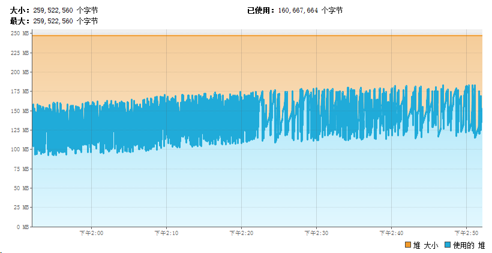

# 问题
Java进程在服务器中运行一段时间，服务不稳定，偶尔出现进程无故的死亡。临时的办法是重启进程，但过一段时间后又无故死亡。没有任何 jvm oom的错误信息。

# 路径
1. 通过jvm监控查看jvm监控状态
    
    从图表上看，进程在在死亡之前一直处于正常状态。先不考虑jvm关于young/old的相关调优。排除由jvm引发的进程猝死。

2. free命令查看机器内存<br>
    既然不是jvm的问题引发的进程死亡，就进一步考虑是否由于机器内存等原因引发的进程猝死。<br>

    
    当时的证据图已不存在，随意找一个只为讲述。

    free命令中第一行从操作系统角度来看各使用量，第二行从程序角度来看各使用量。

    实际上第二行的free是实际真实程序可使用的内存，即3.6G。也等于在第一行中的 free + buffers + cached（在os角度，buffers和cached都属于被使用的，已经被分配。）


3. 确认内存不足，找出进程死亡原因<br>
    确认是内存不足以后，就可以通过操作系统的日志去证明进程的确是被操作系统杀掉。

    - 首先通过dmesg | grep java查看是否有相关数据。dmesg实际展示了大量的系统信息，
    - 通过/var/log/messages找到对应是否有oom_killer杀掉我们的java进程，可以通过关键字oom_killer，也可以通过进程号找到。下面信息是网上找到的相关信息，我的证据由于当时没保留，被清空了。
    ```
      memory: usage 2047696kB, limit 2047696kB, failcnt 23543
      memory+swap: usage 2047696kB, limit 9007199254740991kB, failcnt 0
      ......
      Free swap  = 0kB
      Total swap = 0kB
      ......
      Memory cgroup out of memory: Kill process 18286 (java) score 933 or sacrifice child
    ```
