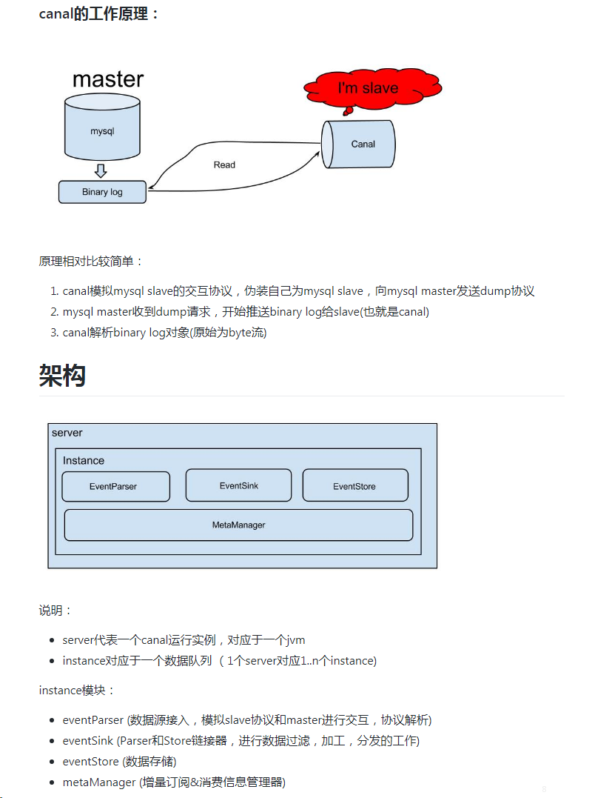

# 概要
当今互联网越来越发达，对于各企业来说，服务的容灾越来越重要，系统一段时间的不可用，都有可能造成企业极大的损失和影响。特别是一些跟钱相关的业务场景，一段时间的不可用，都有可能对用户产生严重的信任问题。像银行这种的业务，国家甚至还规定了全年系统不可用的时间阈值。

传统的同城双机房，同城服务提供服务，数据写入到某个机房（数据库单点写）；到两地三中心，其中一个异地中心做冷备（这种情况下当要发生切换时，由于冷备一直没提供服务，导致流量不敢切换）。到最后演变到现在的异地多活（每个中心都读写）。

可以看出来，容灾方案的发展对基础设施的依赖越来越严重。没有完善的基础设施，想做异地多活，有可能造成各种各样的问题，到最后只会疲于修复问题。

本文不针对异地多活中的某个实际产品来展开，只是取出某些技术细节来阐述。最后把谢串联起来，再分析我们异地多活中的各种产品。

首先我们想一下，要做异地多活，必然涉及到数据的两边写，那么涉及到数据的两边写，最终必然遇到的一个问题就是数据多中心的融合。这也是做异地多活最重要、最复杂的一个环节，因为上层业务的不可用，总有办法做修复，但是数据的不可用（数据错乱等）有可能就会造成业务的混乱，这也许就不是那么容易恢复了。

在做关于底层数据的产品前，我们需要首先明确自己的产品目标。目标是要做一款数据迁移产品，还是想做一款数据订阅变更的产品，甚至是一款数据同步的产品。首先确定好自己的产品形态，就数据迁移和数据订阅，实际上他们实现的思路几乎完全不一样。虽然最终他们可以融合成类似于阿里云的DTS这类的产品，但是在内部实现上，应该首先把他们隔离。否则在产品实施过程中，会顾此失彼，导致两边都做不好。

既然我们要做类似数据订阅、数据同步的产品（在这暂不考虑数据迁移），首先就涉及到需要把变更的数据获取出来。因此就从这开始，由下往上慢慢推出异地多活的整体形态~

获取数据变更的方式，我们知道mysql有binlog的机制，实际上变更的数据都在此。因此我们有2中方案可以获取到数据的变更操作：
1. 监听binlog文件的变更
2. 模拟slave来获取数据的变更

第一种方案监听binlog文件的变更，需要与mysql服务部署在同样的机器中，强耦合在一起，后续扩展能力也比较弱。而第二种方案，模拟slave，实际上只需要网络的打通，无须与mysql耦合，并且现在已经有足够多的开源产品实现此功能：
1. LinkedIn 开源的 databus
2. 阿里开源的 Canal
3. 大众点评的 Puma
4. mysql-binlog-connector-java

本文先从应用比较广泛的 Canal 了解一下其源码以及实现。

# 架构


以上canal在github上的架构图，包含了一个canal中的各个模块：
- eventParser
- eventSink
- eventStore
- metaManager

# 深入了解 Canal 订阅机制
#### 1. Instance的启动
每次我们启动 Canal，实际就是启动一个 Instance 对象。

每次启动，调用AbstractCanalInstance的start方法，AbstractCanalInstance是各 Instance 的基类，其实现有CanalInstanceWithSpring、CanalInstanceWithManager。
```
@Override
public void start() {
    super.start();
    if (!metaManager.isStart()) {
        metaManager.start();
    }

    if (!alarmHandler.isStart()) {
        alarmHandler.start();
    }

    if (!eventStore.isStart()) {
        eventStore.start();
    }

    if (!eventSink.isStart()) {
        eventSink.start();
    }

    if (!eventParser.isStart()) {
        beforeStartEventParser(eventParser);
        eventParser.start();
        afterStartEventParser(eventParser);
    }
    logger.info("start successful....");
}
```

可以从以上代码看出，instance对象持有eventParse、eventSink、eventStore、metaManager并掌握着其生命周期。它是我们整个 Canal 的基础。


#### 2. EventParser的启动
EventParser是canal与mysql打交道的进出口，它由 Instance 对象来持有和启动。

AbstractEventParser是基类，实现有MysqlEventParser（模拟slave）和LocalBinLogEventParser（本地binlog读取）

实际上启动EventParser时，做了以下几个步骤：
1. 初始化一个ringBuffer的缓冲队列（用于存放binlog event数据）
2. 初始化过滤规则eventFilter，实际为binlogParser对象（用于过滤数据）
3. 初始化连接、校验数据库是否符合模拟slave拉取规则
4. 启动心跳线程（可用于检测canal是否假死状态）
5. 获取最后消费的binlog（若没有则从show master status开始）
6. 初始化 sinkHandler 用处处理binlog数据（拉取的event数据并作库表的黑白名单过滤后放入ringBuffer中，由ringbuffer交给eventSink）
7. 开始dump数据（将数据交给sinkHandler）

当 Instance 启动时，调用 eventParser 的 start 方法
```
public void start() {
    // 初始化操作
    ......

    // 配置transaction buffer
    // 初始化缓冲队列
    transactionBuffer.setBufferSize(transactionSize);// 设置buffer大小
    transactionBuffer.start();

    // 构造bin log parser : 该方法中构造配置文件中的内容，如过滤规则等
    binlogParser = buildParser();
    binlogParser.start();


    // 启动工作线程
    parseThread = new Thread(new Runnable() {

        public void run() {

            // 初始化变量
            ......

            while (running) { // 循环重试创建dump任务
                try {

                    // 开始执行replication
                    // 1. 构造Erosa连接：通过配置文件构造mysql连接，底层通过netty去连接
                    erosaConnection = buildErosaConnection();

                    // 2. 启动一个心跳线程（若配置文件中设置detectingSQL则会使用该sql检测）
                    // 用于在即使没有binlog数据时，仍然与mysql保持随时连通状态(从而可以通过监控该连通状态判断canal节点是否假死)
                    // 若配置文件没有设置detect，则默认没有心跳检测，系统会伪造一个心跳包扭转给sink模块
                    startHeartBeat(erosaConnection);

                    // 3. 执行dump前的准备工作:校验是否支持的binlog-format等
                    preDump(erosaConnection);

                    erosaConnection.connect();// 链接


                    // 4. 获取最后的位置信息
                    // 1) 先从自身获取（内存、磁盘、zk等） 2）配置文件中获取 3）连接远程show master status获取 4）若没有配置journalName，则根据配置timestamp获取（连接找出所有binlog，根据时间来找到对应位置） 5）若配置journaName，优先匹配journalName + position，没有position在匹配journamName + timestamp
                    EntryPosition position = findStartPosition(erosaConnection);
                    final EntryPosition startPosition = position;
                    if (startPosition == null) {
                        throw new CanalParseException("can't find start position for " + destination);
                    }
                    logger.info("find start position : {}", startPosition.toString());


                    // 重新链接，因为在找position过程中可能有状态，需要断开后重建
                    erosaConnection.reconnect();

                    final SinkFunction sinkHandler = new SinkFunction<EVENT>() {
                        // 定制处理类
                        ......
                    };

                    // 4. 开始dump数据,交给connection循环dump数据
                    if (StringUtils.isEmpty(startPosition.getJournalName()) && startPosition.getTimestamp() != null) {
                        erosaConnection.dump(startPosition.getTimestamp(), sinkHandler);
                    } else {
                        erosaConnection.dump(startPosition.getJournalName(),
                            startPosition.getPosition(),
                            sinkHandler);
                    }

                } catch (Exception e) {
                  ......
                } finally {
                  ......
                }

                // 出异常了，退出sink消费，释放一下状态：由于进入dump的循环，只有dump出现异常才会走到此
                eventSink.interrupt();
                transactionBuffer.reset();// 重置一下缓冲队列，重新记录数据
                binlogParser.reset();// 重新置位

                if (running) {
                    // sleep一段时间再进行重试
                    try {
                        Thread.sleep(10000 + RandomUtils.nextInt(10000));
                    } catch (InterruptedException e) {
                    }
                }
            }
        }
    });

    ......
}
```

> 注意：
1. eventParser拉取数据后，将数据存放于一个ringBuffer中，而非直接交给eventSink。在交给ringBuffer时，flush方法会回调将event交给eventSink
2. 当配置文件中没有设置detectSQL的语句，心跳是一个伪造的心跳包，而非真是心跳包


以下是启动一个心跳线程，定时将其提交到sink中（consumeTheEventAndProfilingIfNecessary方法）
```
protected void startHeartBeat(ErosaConnection connection) {
    ...... // 初始化timer
    if (heartBeatTimerTask == null) {
        heartBeatTimerTask = buildHeartBeatTimeTask(connection);
        Integer interval = detectingIntervalInSeconds;
        timer.schedule(heartBeatTimerTask, interval * 1000L, interval * 1000L);
    }
}

protected TimerTask buildHeartBeatTimeTask(ErosaConnection connection) {
    return new TimerTask() {

        public void run() {
            try {
                if (exception == null || lastEntryTime > 0) {
                    // 如果未出现异常，或者有第一条正常数据
                    long now = System.currentTimeMillis();
                    long inteval = (now - lastEntryTime) / 1000;
                    if (inteval >= detectingIntervalInSeconds) {
                        ...... // 伪造一个心跳包entry
                        Entry entry = entryBuilder.build();

                        // 提交到sink中，目前不会提交到store中，会在sink中进行忽略
                        consumeTheEventAndProfilingIfNecessary(Arrays.asList(entry));
                    }
                }
            } catch (Throwable e) {
                logger.warn("heartBeat run failed " + ExceptionUtils.getStackTrace(e));
            }
        }

    };
}
```

以下是eventBuffer添加一个event时候的回调方法，同样当EventParser start后，接受到数据以后，会把数据交给sinkHandler，sinkHandler拿到数据后加入到eventBuffer中，并回调以下方法
```
public AbstractEventParser(){
    // 初始化一下
    transactionBuffer = new EventTransactionBuffer(new TransactionFlushCallback() {

        public void flush(List<CanalEntry.Entry> transaction) throws InterruptedException {
            boolean successed = consumeTheEventAndProfilingIfNecessary(transaction);

            ......
        }
    });
}
```

可以从上面看出来，心跳包和binlog的数据包，均通过consumeTheEventAndProfilingIfNecessary这个方法来将数据交给EventSink，至此EventParser的任务基本是完成。


#### 3. 数据过滤 EventSink
数据经过 eventParser 传递给EventSink，从上一节中，已经可以看出具体数据的扭转过程了。现在再来看看sink 中是如何工作的。

sink 模块，逻辑相对比较简单。实际就做了几个操作：
1. 从 eventParser 中获取数据
2. 经过一些过滤规则（过滤事务头尾、自定义过滤加工规则等）传递到 eventStore 中

EventSink有EntryEventSink、GroupEventSink，默认使用EntryEventSink。
```
// 构造函数，创建EntryEventSink时，默认创建心跳处理类
public EntryEventSink(){
    addHandler(new HeartBeatEntryEventHandler());
}

// 当EventParser拿到数据、心跳后，实际上会传送到此方法
public boolean sink(List<CanalEntry.Entry> entrys, InetSocketAddress remoteAddress, String destination) throws CanalSinkException,InterruptedException {
    List rowDatas = entrys;
    if (filterTransactionEntry) { // 是否需要过滤头尾事务
        ......
    }
    return sinkData(rowDatas, remoteAddress);
}


private boolean sinkData(List<CanalEntry.Entry> entrys, InetSocketAddress remoteAddress) throws InterruptedException {
    ......
    // 遍历事务数据并封装成Event
    for (CanalEntry.Entry entry : entrys) {
        Event event = new Event(new LogIdentity(remoteAddress, -1L), entry);
        // 过滤 - 规则在配置文件中
        if (!doFilter(event)) {
            continue;
        }
        ......
    }

    if (hasRowData) {
        // 存在row记录
        return doSink(events);
    } else if (hasHeartBeat) {
        // 存在heartbeat记录，直接跳给后续处理
        return doSink(events);
    } else {
        // 需要过滤的数据
        if (filterEmtryTransactionEntry && !CollectionUtils.isEmpty(events)) {
            long currentTimestamp = events.get(0).getEntry().getHeader().getExecuteTime();
            // 基于一定的策略控制，放过空的事务头和尾，便于及时更新数据库位点，表明工作正常
            if (Math.abs(currentTimestamp - lastEmptyTransactionTimestamp) > emptyTransactionInterval
                || lastEmptyTransactionCount.incrementAndGet() > emptyTransctionThresold) {
                lastEmptyTransactionCount.set(0L);
                lastEmptyTransactionTimestamp = currentTimestamp;
                return doSink(events);
            }
        }

        // 直接返回true，忽略空的事务头和尾
        return true;
    }

    protected boolean doSink(List<Event> events) {
        // 通过handler处理掉一些事务数据，如心跳包，可以自己扩展
        for (CanalEventDownStreamHandler<List<Event>> handler : getHandlers()) {
            events = handler.before(events);
        }

        int fullTimes = 0;
        do {
            // 交给eventStore
            if (eventStore.tryPut(events)) {
                for (CanalEventDownStreamHandler<List<Event>> handler : getHandlers()) {
                    events = handler.after(events);
                }
                return true;
            } else {
                applyWait(++fullTimes);
            }
            ......

        } while (running && !Thread.interrupted());
        return false;
    }
}
```


#### 3. 数据存储 EventStore
eventStore 当前开源版本只有 MemoryEventStoreWithBuffer 的实现，实现采用了 ringBuffer 的实现。需要扩展 store 可以实现 CanalEventStore、CanalStoreScavenge并继承AbstractCanalStoreScavenge，在这暂时不展开。

Canal 的几个主要模块过了一下，整体的流程了解了。但是 meta 的实现好像并没有连贯起来，那 meta 的相关实现到底在哪里呢？

#### 4. 位置点 meta
回顾一下，在 eventParser -> eventSink -> eventStore 过程中，位置的信息只出现在 EventParser 中，每次 start 时会去获取最后一次消费的位置，从内存、本地文件或者zk中获取。那这位置点信息又是什么时候写进去？

先来看一下EventParser的构造函数，之前讲述了如何交给sink，现在来看后半段
```
public AbstractEventParser(){
    // 初始化一下
    transactionBuffer = new EventTransactionBuffer(new TransactionFlushCallback() {

        public void flush(List<CanalEntry.Entry> transaction) throws InterruptedException {
            boolean successed = consumeTheEventAndProfilingIfNecessary(transaction);
            if (!running) {
                return;
            }

            if (!successed) {
                throw new CanalParseException("consume failed!");
            }

            // 通过 entry 构造 position 对象
            LogPosition position = buildLastTransactionPosition(transaction);
            if (position != null) { // 可能position为空
                // 持久化 position 位置
                logPositionManager.persistLogPosition(AbstractEventParser.this.destination, position);
            }
        }
    });
}
```
当 eventParser 将数据交给 eventSink 后（通过加入到ringBuffer回调），会构造一个position的位置并记录。logPositionManager 默认在spring中注入，通过 AbstractLogPositionManager 这个基类，衍生出（FailbackLogPositionManager、FileMixedLogPositionManager、MemoryLogPositionManager、MetaLogPositionManager、PeriodMixedLogPositionManager、ZookeeperLogPosition），默认采用FailbackLogPositionManager

以下是FailbackLogPositionManager记录位点的实现
```
public void persistLogPosition(String destination, LogPosition logPosition) throws CanalParseException {
    try {
        primary.persistLogPosition(destination, logPosition);
    } catch (CanalParseException e) {
        logger.warn("persistLogPosition use primary log position manager exception. destination: {}, logPosition: {}",
            destination,
            logPosition,
            e);
        secondary.persistLogPosition(destination, logPosition);
    }
}
```
默认primary是MemoryLogPositionManager（使用内存保存当前位置点），secondary是MetaLogPositionManager（内部使用CanalMetaManager来实现，该实现实现与canal的消费者相关）。可以在上述代码看到，canal从mysql拉取binlog时，每次提交到 ringbuffer 后，通过回调将位置信息记录在primary（内存），只有失败才使用secondary记录（实际secondary记录的实现为空，也就是在拉取mysql binlog时，位置只会记录在jvm内存）

为什么会有这样的设计？只存在内存，重启怎么办？会丢数据？

首先我们回想一下，instance 在 start 的时候也会启动一个 metaManager， 那么我们看一下这个 metaManager 是什么。

实际上每个metaManager，其接口都是实现 CanalMetaManager，有FileMixedMetaManager、MemoryMetaManager、MixedMetaManager、PeriodMixedMetaManager、ZookeeperMetaManger

先来看一下默认使用的 PeriodMixedMetaManager 实现，继承 MemoryMetaManager
```
// 启动操作，instance 启动时会调用
public void start() {
    // 初始化操作
    ......

    // 启动定时工作任务:定时将binlog position的位置刷入zk中
    executor.scheduleAtFixedRate(new Runnable() {

        public void run() {
            List<ClientIdentity> tasks = new ArrayList<ClientIdentity>(updateCursorTasks);
            for (ClientIdentity clientIdentity : tasks) {
                try {
                    // 定时将内存中的最新值刷到zookeeper中，多次变更只刷一次
                    zooKeeperMetaManager.updateCursor(clientIdentity, getCursor(clientIdentity));
                    updateCursorTasks.remove(clientIdentity);
                } catch (Throwable e) {
                    // ignore
                    logger.error("period update" + clientIdentity.toString() + " curosr failed!", e);
                }
            }
        }
    }, period, period, TimeUnit.MILLISECONDS);
}

// 该方法在canal客户端连接上canal时，会触发；即开始消费数据时，会往zk写入消费方的信息
public void subscribe(final ClientIdentity clientIdentity) throws CanalMetaManagerException {
    super.subscribe(clientIdentity);

    // 订阅信息频率发生比较低，不需要做定时merge处理
    executor.submit(new Runnable() {

        public void run() {
            zooKeeperMetaManager.subscribe(clientIdentity);
        }
    });
}

// 该方法在canal客户端连接上canal或canal客户端拿到数据后并返回ack时（canal客户端拿完数据）
public void updateCursor(ClientIdentity clientIdentity, Position position) throws CanalMetaManagerException {
    // 优先更新 memory 中的值
    super.updateCursor(clientIdentity, position);
    // 加到队列中，由定时任务触发写入zk
    updateCursorTasks.add(clientIdentity);// 添加到任务队列中进行触发
}
```
