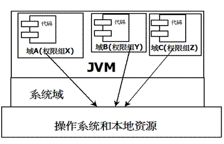

# 问题
上一期在使用到MappedByteBuffer时，采用的其中一种方式（AccessController）来释放已分配的内存映射，今天具体探讨一下AccessController的前世今生。

回顾上一期代码：
```
AccessController.doPrivileged(new PrivilegedAction() {
    public Object run() {
      try {
        Method getCleanerMethod = buffer.getClass().getMethod("cleaner", new Class[0]);
        getCleanerMethod.setAccessible(true);
        sun.misc.Cleaner cleaner = (sun.misc.Cleaner)
        getCleanerMethod.invoke(byteBuffer, new Object[0]);
        cleaner.clean();
      } catch (Exception e) {
        e.printStackTrace();
      }
      return null;
    }
});
```

首先我们先了解一个概念，在Java的设计中，实际上是有安全上的考虑，但是大家在开发过程中，很少接触这方面，也几乎用不到。所以关于这方面的材料也不多，网上找到的基本都是[Java安全模型介绍](https://www.ibm.com/developerworks/cn/java/j-lo-javasecurity/) 。

本文中采用的示例说明基本也摘抄自上述文章。

# 代码入手
我们先抛开所有概念，从代码入手来看看现在的Java安全模型是如何实现的。

## 1. 前提
两个项目，一个X项目，一个Y项目

X项目对于<font color=red>某个目录（目录属于X项目）</font>有写权限（该权限由Java安全模型控制，后续会讲到）<br>
Y项目调用X项目中的写文件工具类，且Y项目没有授权<font color=red>某个目录</font>的写权限

## 2. 代码块
<b>X项目</b>(项目路径：D:\workspace\projectX\；代码路径在项目路径bin目录下；某个目录：D:\workspace\projectX\bin)：
```
package learn.java.security;

import java.io.File;
import java.io.IOException;
import java.security.AccessControlException;
import java.security.AccessController;
import java.security.PrivilegedAction;

public class FileUtil {
   // 工程 A 执行文件的路径
   private final static String FOLDER_PATH = "D:\\workspace\\projectX\\bin";

   public static void makeFile(String fileName) {
       try {
           // 尝试在工程 A 执行文件的路径中创建一个新文件
           File fs = new File(FOLDER_PATH + "\\" + fileName);
           fs.createNewFile();
       } catch (AccessControlException e) {
           e.printStackTrace();
       } catch (IOException e) {
           e.printStackTrace();
       }
   }

   public static void doPrivilegedAction(final String fileName) {
       // 用特权访问方式创建文件
       AccessController.doPrivileged(new PrivilegedAction<String>() {
           @Override
           public String run() {
               makeFile(fileName);
               return null;
           }
       });
   }
}
```

<b>Y项目</b>(项目路径：D:\workspace\projectY\；代码路径在项目路径bin目录下)
```
package demo.security;

import java.io.File;
import java.io.IOException;
import java.security.AccessControlException;

import learn.java.security.FileUtil;

public class DemoDoPrivilege {

   public static void main(String[] args) {
       System.out.println("***************************************");
       System.out.println("I will show AccessControl functionality...");

       System.out.println("Preparation step : turn on system permission check...");
       // 打开系统安全权限检查开关
       System.setSecurityManager(new SecurityManager());
       System.out.println();

       System.out.println("~~~~~~~~~~~~~~~~~~~~~~~~~~~~~~~~~~~~~~~~~");
       System.out.println("
       Create a new file named temp1.txt via privileged action ...");
       // 用特权访问方式在工程 A 执行文件路径中创建 temp1.txt 文件
       FileUtil.doPrivilegedAction("temp1.txt");
       System.out.println("~~~~~~~~~~~~~~~~~~~~~~~~~~~~~~~~~~~~~~~~~");
       System.out.println();

       System.out.println("/////////////////////////////////////////");
       System.out.println("Create a new file named temp2.txt via File ...");
       try {
           // 用普通文件操作方式在工程 A 执行文件路径中创建 temp2.txt 文件
           File fs = new File(
                   "D:\\workspace\\projectX\\bin\\temp2.txt");
           fs.createNewFile();
       } catch (IOException e) {
           e.printStackTrace();
       } catch (AccessControlException e1) {
           e1.printStackTrace();
       }
       System.out.println("/////////////////////////////////////////");
       System.out.println();

       System.out.println("-----------------------------------------");
       System.out.println("create a new file named temp3.txt via FileUtil ...");
       // 直接调用普通接口方式在工程 A 执行文件路径中创建 temp3.txt 文件
       FileUtil.makeFile("temp3.txt");
       System.out.println("-----------------------------------------");
       System.out.println();

       System.out.println("***************************************");
   }
}
```

至此代码已完。现在开始对安全开始授权，假设有以下授权策略文件（MyPolicy.txt）放在Y工程根目录下：
```
// 授权项目X的Java执行文件在其某目录中的写文件权限
grant codebase "file:/D:/workspace/projectX/bin"
{
 permission java.io.FilePermission
   "D:\\workspace\\projectX\\bin\\*", "write";
};
```
即可指定安全文件运行程序：
```
java -Djava.security.policy=.\\MyPolicy.txt -classpath
D:\workspace\projectY\bin;D:\workspace\projectX\bin demo.security.DemoDoPrivilege
```
执行结果：
```
***************************************
I will show AccessControl functionality...
Preparation step : turn on system permission check...

~~~~~~~~~~~~~~~~~~~~~~~~~~~~~~~~~~~~~~~~
Create a new file named temp1.txt via privileged action ...
~~~~~~~~~~~~~~~~~~~~~~~~~~~~~~~~~~~~~~~~

////////////////////////////////////////
Create a new file named temp2.txt via File ...
java.security.AccessControlException: Access denied (java.io.FilePermission
     D:\workspace\projectX\bin\temp2.txt write)
    at java.security.AccessController.checkPermission(AccessController.java:108)
    at java.lang.SecurityManager.checkPermission(SecurityManager.java:533)
    at java.lang.SecurityManager.checkWrite(SecurityManager.java:963)
    at java.io.File.createNewFile(File.java:882)
    at demo.security.DemoDoPrivilege.main(DemoDoPrivilege.java:32)
////////////////////////////////////////

----------------------------------------
create a new file named temp3.txt via FileUtil ...
java.security.AccessControlException: Access denied (java.io.FilePermission
    D:\workspace\projectX\bin\temp3.txt write)
    at java.security.AccessController.checkPermission(AccessController.java:108)
    at java.lang.SecurityManager.checkPermission(SecurityManager.java:533)
    at java.lang.SecurityManager.checkWrite(SecurityManager.java:963)
    at java.io.File.createNewFile(File.java:882)
    at learn.java.security.FileUtil.makeFile(FileUtil.java:16)
    at demo.security.DemoDoPrivilege.main(DemoDoPrivilege.java:43)
----------------------------------------

***************************************
```
从执行结果可以看出，当安全模式生效时，Y项目通过普通接口（调用已有权限的代码）、自己创建的方式都无法在没有权限的目录下操作。只有通过特权访问（AccessController）的方式才成功。

可以看出，要想访问安全资源，要么在调用链上权限齐全（即自己有对应的权限），要么就有特权访问。

一直在说特权访问，从实现上看已大概了解特权访问了，那实际上又是什么呢？

## 3. 特权访问
在Java中执行程序分为本地和远程两种，本地代码默认都是可信任的，而远程代码被看作不受信的。在以前的Java版本中，不授信的远程代码基于沙箱机制，只能访问限定在JVM特定的运行范围中，并严格控制代码对本地资源的访问。而本地代码可以访问一切本地资源。有效隔离远程代码，防止对本地系统造成破坏。

关于Java安全机制的发展史可参考上面关于安全机制的链接。

发展到现在，安全模型引入了域的概念。将代码加载到不同的系统域和应用域，系统域负责与关键资源交互，各应用域通过系统域的代理对各种需要的资源进行访问（如上述Y项目通过X项目对资源进行写入）。虚拟机不同的受保护域，对应不一样的权限（permission）。存在域中的类文件就有了当前域的全部权限（如上述X项目有X域的权限而Y项目没有）


看过整个的安全模型，在用法上，最常用就是上述的API（doPrivileged），能使一段受信代码获得最大权限，甚至比调用他的应用程序还多（如Y调用X，明显比Y权限多），可临时访问更多资源。<br>
主要用于一些特殊应用场景：应用无法直接访问某些系统资源，但应用又必须得到这些资源才能完成功能。doPrivileged让程序突破当前域权限限制，临时扩大访问权限。

> AccessController的工作机制：<br>
> 在某个线程调用栈中，当AccessController的checkPermission方法被最近调用程序（如上述代码创建文件时）调用时，对于程序要求的访问权限，ACC决定是否授权算法如下：
> 1. 如果调用链中某个调用程序没有需要的权限，抛出AccessControlException（如上述代码Y无权限）
> 2. 满足以下情况即被授权
  >   - 调用程序访问另一个有该权限的方法，且此方法标记为有访问特权（如上述代码Y调用X的特权方法）
>   - 调用程序调用的（直接或间接）后续对象有权限（如上述代码X有权限）


# 回归问题本质
我们mmap也没有使用外部远程代码，何必用AccessController这么复杂，直接把AccessController去掉试一下。实际上看貌似也是没问题的。那为什么那么多的例子都是用AccessController来释放资源呢？<br>
但由于Cleaner是在rt.jar包中，所以有可能会出现没有权限访问的情况，jvm把其加入不同域中。暂时来看只是猜测。
