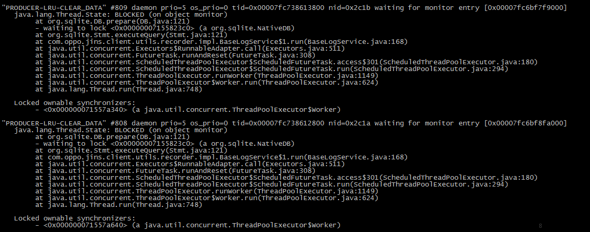
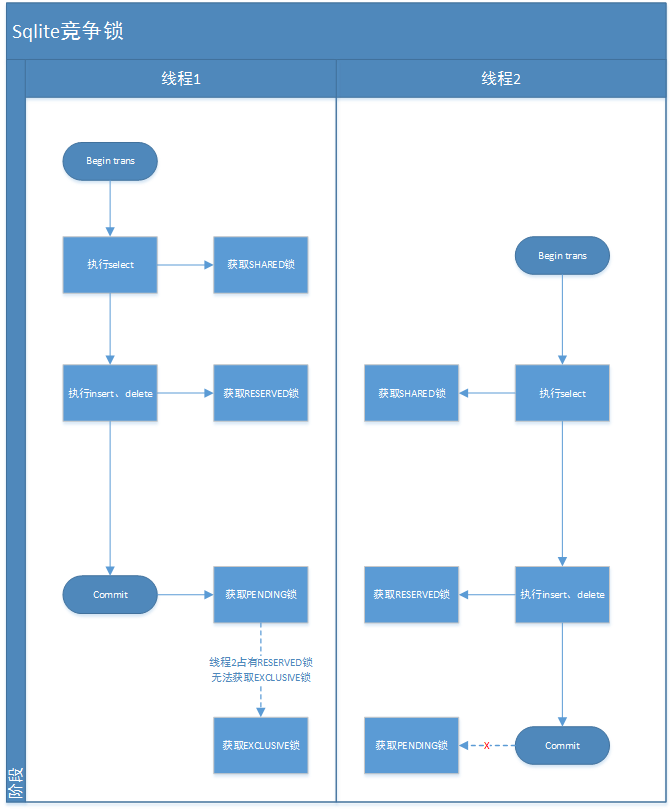

在之前的篇章中，我们介绍过sqlite的锁机制。从流程图上看来，似乎没什么太大的问题（事实上运行一段时间也没有出现问题）

但实际操作中，我们发现程序偶尔就出现卡死的情况。通过jstack可以看出来很多的线程处于BLOCK阶段。

从sqlite文件锁的机制来看。不应该发生死锁的情况吧？

深入了解一下情况，实际会发现这当中既有sqlite的问题，又有自己程序的问题，顺便更深入理解了一下sqlite锁的机制了。

我们可以通过以下流程图，看一下当两个线程竞争时造成的死锁问题：

1. 程1在一个事务中，通过读写先后获取SHARED锁和RESERVED锁后

2. 线程2也同样通过读写获取SHARED和RESERVED锁，由于RESERVED锁是非排他锁，因此线程2顺利获取SHARED锁。

3. 当线程1要commit时，获得了排他锁PENDING了，但由于当先线程2已获取到了SHARED锁，因此线程1会一直在PENDING中等待线程2

4. 线程2同样要执行写操作，因此他从SHARDED锁进入了RESERVED锁了，此时的线程1还在PENDING傻傻等待着。

5. 线程2要commit时，就尴尬了，由于PENDING只能由一个获取，因此他又在等待线程1了

这样看来，就完美的进入了死锁的阶段了。

实际上造成这个的原因，有一部分也是因为我这粗制滥造的程序引起的。在我的程序中通过jdbc设置了autocommit为false，并且有一个线程去轮询查询sqlite的某些值并对其做增删改的操作，但在方法结束时，并没有立刻commit操作（本想在达到操作一定量的数据以后再去做对应的commit操作），因此就尴尬的出现了这个问题了。

当然上述由于程序的粗制滥造，只是为这个问题提供了良好的土壤。实际上你可以发现，即使立刻commit，也还是会有几率出现死锁的问题了，只不过减少的发生的概率而已。

那么我们如何避免呢？

## 预防死锁
实际上我们对死锁这种问题还是有办法避免的

#### 1. 事务类型
首先我们要了解sqlite有三种事务类型

事务类型  | 说明
----------|-------------------------------------|--
Deferred  | 直到必须使用才获取锁（默认）
Immediate | 在begin执行时获取预留锁（RESERVED）
Exclusive | 试图获取排他锁

通过begin immediate | exclusive transaction来实现开始事务时获取的锁，使用immediate可以即可减少其死锁了。因为不能同时存在两个RESERVED锁的存在。

使用exclusive，则由于容易造成长期阻塞，降低并发性能。

#### 2. 程序控制
通过保证线程安全来防止死锁
- 单线程模式，使用一个专门线程访问数据库
- 单线程模式，使用一个线程队列访问数据库（队列里线程共用一个数据库连接）
