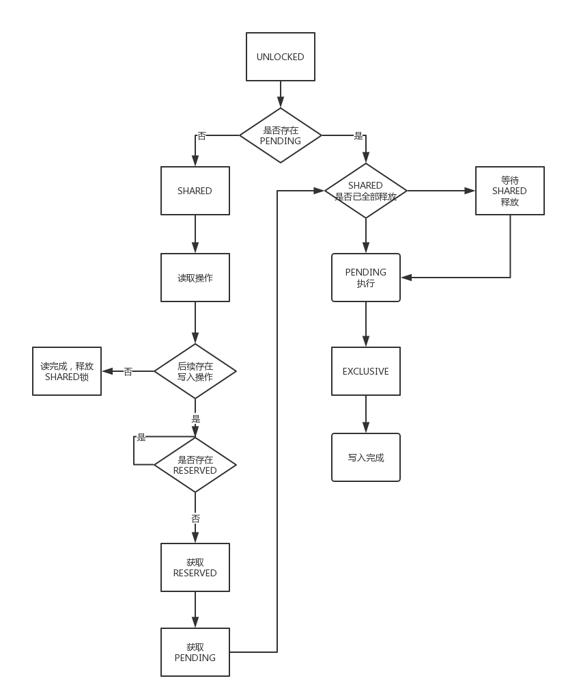

sqlite作为内嵌式数据库，具有轻量级的特点。实现了自给自足、无服务器、零配置、事务性的SQL数据库引擎。

因为其轻量级的特点，移动端中多采用它作为本地存储引擎。后端服务中，也由于其轻便、事务兼容ACID等（关于ACID详细说明可关注后续文章）特性，集成在提供给外部方使用的SDK中做数据的本地存储，方便后续在SDK中做数据的聚合查询等操作。

但是sqlite不是万能的，它的轻量级有其轻量级的特点。

### 数据库锁
首先我们看以下监控图，我们的业务场景是将数据写入到MQ队列中，写成功后把写入操作记录在sqlite（整体过程不涉及异步操作），同时每5分钟会有另外的线程去sqlite中查询写入操作的记录：

可以从上图看出，黄色的生产数据线条（publish）每5分钟出现一个下降，造成每5分钟出现一个尖刺。

#### 为什么在读数据时，写入操作会收到影响？
要搞清楚这个问题，首先我们要了解sqlite的数据库锁机制。它的锁机制与我们所了解的mysql锁机制完全不同（有兴趣了解mysql锁机制可关注后续文章）

sqlite在当前版本中，主要提供了以下5种文件锁状态
1. UNLOCKED： 文件没有持有任何锁，即当前数据库不存在任何读或写的操作。其它的进程可以在该数据库上执行任意的读写操作。此状态为缺省状态。
2. SHARED： 在此状态下，该数据库可以被读取但是不能被写入。在同一时刻可以有任意数量的进程在同一个数据库上持有共享锁，因此读操作是并发的。换句话说，只要有一个或多个共享锁处于活动状态，就不再允许有数据库文件写入的操作存在。
3. RESERVED： 假如某个进程在将来的某一时刻打算在当前的数据库中执行写操作，然而此时只是从数据库中读取数据，那么我们就可以简单的理解为数据库文件此时已经拥有了保留锁。当保留锁处于活动状态时，该数据库只能有一个或多个共享锁存在，即同一数据库的同一时刻只能存在一个保留锁和多个共享锁。在Oracle中此类锁被称之为预写锁，不同的是Oracle中锁的粒度可以细化到表甚至到行，因此该种锁在Oracle中对并发的影响程序不像SQLite中这样大。
4. PENDING： PENDING锁的意思是说，某个进程正打算在该数据库上执行写操作，然而此时该数据库中却存在很多共享锁(读操作)，那么该写操作就必须处于等待状态，即等待所有共享锁消失为止，与此同时，新的读操作将不再被允许，以防止写锁饥饿的现象发生。在此等待期间，该数据库文件的锁状态为PENDING，在等到所有共享锁消失以后，PENDING锁状态的数据库文件将在获取排他锁之后进入EXCLUSIVE状态。
5. EXCLUSIVE： 在执行写操作之前，该进程必须先获取该数据库的排他锁。然而一旦拥有了排他锁，任何其它锁类型都不能与之共存。因此，为了最大化并发效率，SQLite将会最小化排他锁被持有的时间总量。

看了上面一堆话，实际上总结起来就是，当sqlite在进行读取操作时，会持有读锁（SHARED），此时做写入操作，需要等待所有读锁释放才可以写入成功。但这样如果一直有新的读操作，可能会造成写阻塞，因此在写入时，会给予他一个等待的PENDING锁，持有这个锁以后，新的读操作就不能再获取读锁，从而避免写无限等待的尴尬。

😂 一句话就是读写互斥吧～

> sqlite所有数据都存储在一个文件中，如此粗粒度的文件锁造就他在并发与伸缩性上与我们常见的关系型数据库是无法比拟的。

所以从其锁的机制，我们可以看出来为什么在刚开始的监控图标中出现了如此的尖刺情况。就是因为我们每5分钟去读取的时候读写锁互斥造成的。

那么我们如何解决呢？
实际上解决的办法很多。譬如采用异步写，或者加上一个队列做批量写操作等等，同时采用批量写的时候也提高了sqlite写入的性能。

那么既然说到优化sqlite写入性能，到底sqlite的写入性能如何呢？

我们可以继续关注后续文章，将会继续为你揭晓sqlite性能优化之路～
