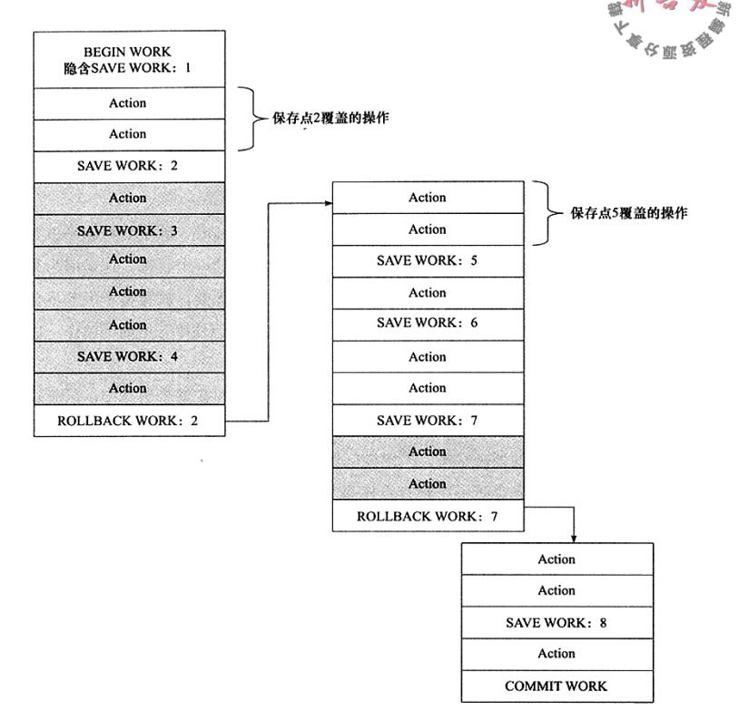
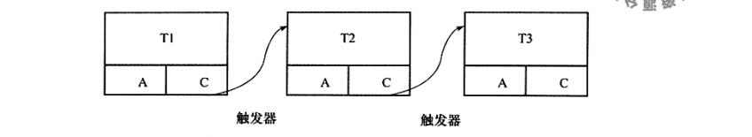
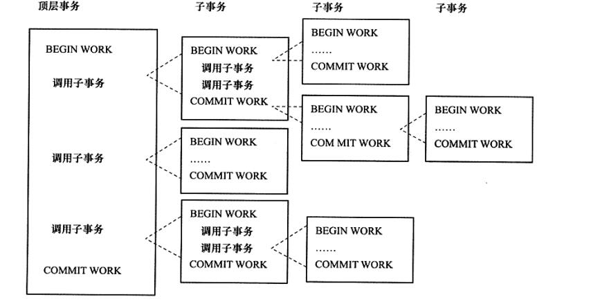

# <b>概览</b>
最近在做数据库相关的中间件，为了更深入的了解数据库相关知识，整理了一下一些资料，尝试讲述一下关于数据库的相关知识。由于数据库的知识博大精深，因此分了几个章节来讲述。

首先我们先来了解一个概念，数据库跟我们文件系统最大的区别，就是其事务特性。它是我们在访问并更新数据库各个数据项的一个程序执行单元。保证了我们数据库从一个一致的状态转换为另外一个的一致状态。 
在文件系统中，我们没办法保证在操作两个或多个文件时，能同时成功（或者同时失败）。这个道理很容易理解，当我们操作完一个文件时，突然发生宕机或各种情况，导致后续操作终止了，当该文件系统重启或恢复时，已经操作的文件也无法回滚了，未操作的文件，有可能程序也不知道该从哪个时间点开始切入继续执行了。

因此数据库事务的意义就诞生了。理论上，数据库事务在设计时，必须满足了ACID的特性（虽然是理论上，但是厂商出于各种目的，并没严格遵循这个标准）。如Oracle的事务隔离级别是READ COMMITED，就不满足I的要求。

# <b>事务的ACID特性</b>
- 原子性
- 一致性
- 隔离性
- 持久性

## 原子性（Atomicity）
保证在一个事务中的操作是原子操作。整个数据库事务是不可分割的工作单位。只有事务所有操作执行成功才算成功。
> e.g 我们银行转账，A账户往B账户转200元。在A账户扣除200元的同时，B账户也需要增加200元，这两个操作必须同时成功或同时失败。否则只有一个成功，那么要不就A少了200元，要不B多了200元。凭空就产生了200元漏洞，这明显不可接受。

## 一致性（Consistency）
保证在一个事务执行前后，数据保证一致。简单说，就是数据库从一种状态转变为另外一种状态。如数据库完整性约束在事务前后没被破坏，数据库的唯一性约束在事务前后没被破坏等。
> e.g 保证数据库完整性约束，a+b=10,一个事务改变了a，b也随之改变。又例如，一个有唯一约束的表，事务前后都不违背其唯一约束的特性。

## 隔离性（Isolation）
也称为并发控制、锁等。使用悲观或乐观锁机制实现（后续关于数据库文章会详细讲述）。确保并发执行的事务能按顺序一个一个的执行，一个未完成的事务并不会影响另一个事务（即每个读写事务都相互分离，互相不可见，通常可以用锁来实现），当前数据库提供了一种粒度锁来锁住一个实体对象的子集（可以理解为锁住了表中的某一行，甚至更深入等等）以此来提高并发度。
> e.g mysql innodb中默认使用READ REPEATABLE，符合隔离性的要求。但是想oracle默认使用READ COMMITED，提高了效率，就没满足隔离性的要求（一个事务影响着另外一个事务）。但是有可能引发另外的问题，这个后面再来讨论。

## 持久性（Durability）
一个成功提交（commit）的事务，将永久改变其系统状态。即使由于系统崩溃或断电，事务中的数据改变未写入磁盘，那么系统恢复后也会将此数据恢复。但是需要明白这个持久性是保证了数据库的可靠性，并不是保证数据库的可用性，如某个数据库RAID卡损坏、各种自然灾害等等，这些需要的是数据库的可用性来保证，现在针对于数据库的可用性，已经有很多方案了，在这里就先不做阐述了。

> 这里可能有人会好奇，既然我都提交（commit）了，那么我的数据理所当然的保存在存储系统中了，这还属于一个特性？ 
实际上，在Mysql中，数据库为了高效，我们提交事务时，并不会立刻写入数据文件中（如果每个提交都写入数据文件中，那我们的数据库性能也太差了），中间通过了类似各种buffer，redo，undo等等的日志文件(这些后续的章节都会聊到)，因此这个持久性，这么看来就很有必要了。

了解完了我们的数据库事务特性以后，我们再来看看我们现在事务运用场景的几个类别。

# <b>事务的类型</b>
- 扁平事务
- 带保存点的扁平事务
- 链式事务
- 嵌套事务
- 分布式事务

## 扁平事务
实际上我们最平常使用的就是扁平事务。通常就以一个begin开始事务，以一个commit作为结束事务（甚至以一个rollback来回滚事务）。

现在在Java甚至很多语言的实现中，甚至已经不用你去begin或commit的操作了，DAL框架基本帮你做完了这个事。如果你的Java中使用spring这些DAL框架，可以回忆一下是不是在程序中配置过TransactionManager，然后又将这个transactionManager运用到各种aop上，实际上运用在aop时，它以方法为切面，就已经帮你开启和结束了事务。这种傻瓜式的编程，对程序开发者是极为方便的，但也是一种慢性毒药，慢慢让开发者变成傻瓜，云里雾里的操作完了数据库，也不知道自己用了事务的操作。

甚至于我们在使用jdbc（Java操作数据库的基本类库）时，由于数据库的连接（Connection）是自动提交事务的，因此我们根本不需要去启停事务，直接操作就是了。完了底层帮你将每个sql语句作为一个一个的事务提交了，还是屏蔽掉了事务的细节，让你一傻再傻。

<b>存在的问题:</b> 
扁平事务是我们最常用的例子，但是既然存在别的种类的事务，那就代表它不能满足我们所有需求。 
我们可以想象一下，当我们在xx旅行网上买一个北京到悉尼的机票时，发现没有直达的机票，那么我们只能选择中转方案，如先买北京到香港的机票，再买香港到悉尼的。但是买完了北京到香港的，我们发现香港到悉尼的机票当天无票了，需要下一天，那这时候，我们不可能把你北京到香港的机票也回滚重新再来执行一次吧，这也太不智能了。因此我们由此引出第二个类别：带保存点的扁平事务。

## 带保存点扁平事务
带保存点的扁平事务，实际上就解决了我们上述的问题了。当我们买完从北京到香港的机票的时候，记录一下保存点（savepoint），当我想做回滚操作时，我就回退到我想要的保存点即可。

实际上扁平事务也属于带保存点的扁平事务，只不过他只有一个保存点，在其开始事务的时候，因此我们回滚操作，也只能回滚到最初的操作。

保存点操作在数据库中使用SAVE WORK函数来操作。拿网上都有的一张图来看一下这个带保存点的扁平事务：

保存点是单调递增的（即使被回滚），可以从途中看到，即使3，4的保存点被回滚，下一个保存点也是从5开始计数。

## 链式事务
链式事务是带保存点扁平事务的一个变种，我们先来看一下下面的图：

在提交T1事务的同时，开启T2事务，这两个操作是一个原子操作。且提交完T1，则释放T1的数据对象。因此回滚操作只能在当前事务中进行，如T2C回滚到T2A这种操作。

## 嵌套事务

关于嵌套数据库事务，我们对着图来说。首先有几个比较显著的特点：
1. 所有与数据库相关的操作均在叶子节点（可以多层嵌套）的事务中。且叶子节点必然为扁平事务。
2. 某个事务回滚，其所有子事务均回滚。
3. 子事务提交，操作不立刻生效，即不满足ACID中的D特性，只有父亲事务提交，才是真正的提交。即最终所有的提交都在顶层事务。

以上是嵌套事务的一些特点，但是并不是所有的数据库都实现了嵌套事务，像Mysql的InnoDB就没有嵌套事务。事实上，我们发现，嵌套事务大多也可以用带保存点的事务来实现，我们先来看一下下面这种图，就是用带保存点的扁平事务来实现嵌套事务的功能

从图中我们可以看出来，Tk1，Tk11，Tk12，Tk121，Tk2，Tk3，Tk31都是保存点。我们可以实现回滚到任意一个保存点。这样的功能甚至比嵌套事务更灵活（只能回滚自己的事务，或者由父亲来回滚所有子事务）。 
如此灵活带来了另外的一个问题，其事务中所有的锁都是共享的，因为这扁平事务中，修改的任何数据，实际都在这个事务中，因此对后面各个保存点（虚拟出来的子事务）都是可见的。而嵌套事务，实际上可以由父亲来决定是否要将其持有的锁（其做的修改）传递给子事务中。 
因此带保存点的扁平事务虽然可以模仿嵌套事务，但是是带着缺陷的模仿。

## 分布式事务
分布式事务，实际上就是在一个分布式环境下的扁平事务，通过例子瞬间就可以理解
> e.g 我们去银行做转账（譬如招商银行转账到中国银行），通过银行终端点击转账时，实际上会有2个步骤：
> 1. 从招商银行的数据库中划走这笔钱
> 2. 从中国银行的数据库中加入这笔钱 
>
> 这两个步骤必须同时成功，或同时失败，否则必然是灾难的。这就是我们所说的分布式事务了。

# <b>结束语</b>
上面简单聊了一下关于数据库事务的特性和类型。里面很多处讲到了关于锁，还有关于ACID的特性，在后面会有更多的篇幅来讲述相关的内容，请继续关注后续文章。

微信公众号：酱君挺怎样
知乎：酱君挺怎样
